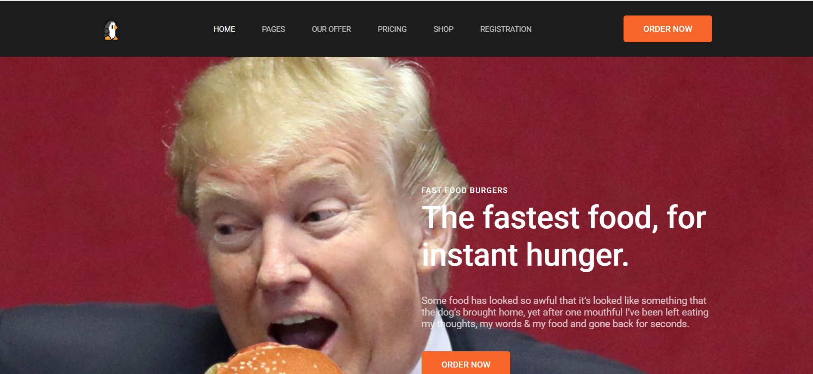
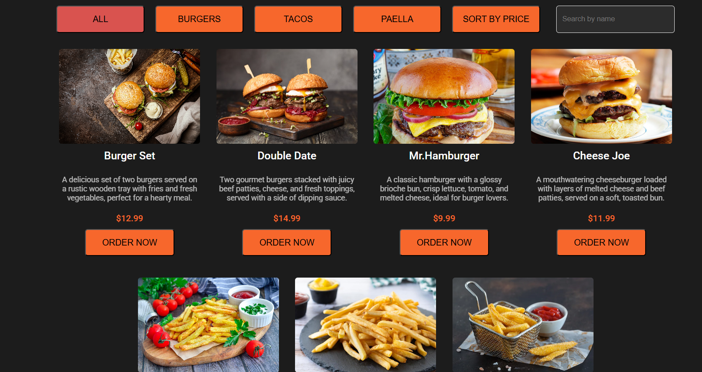
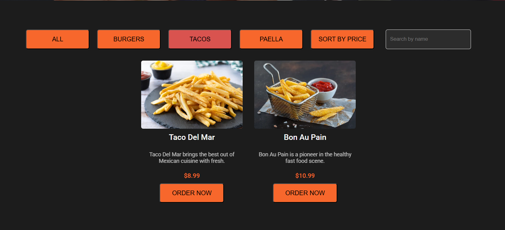
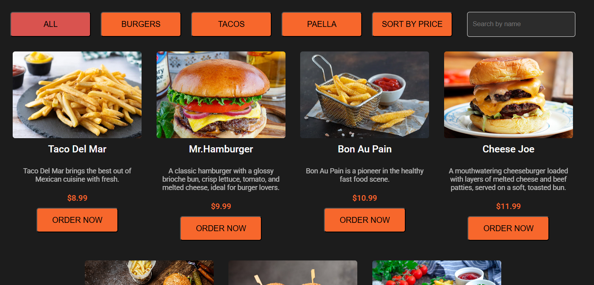
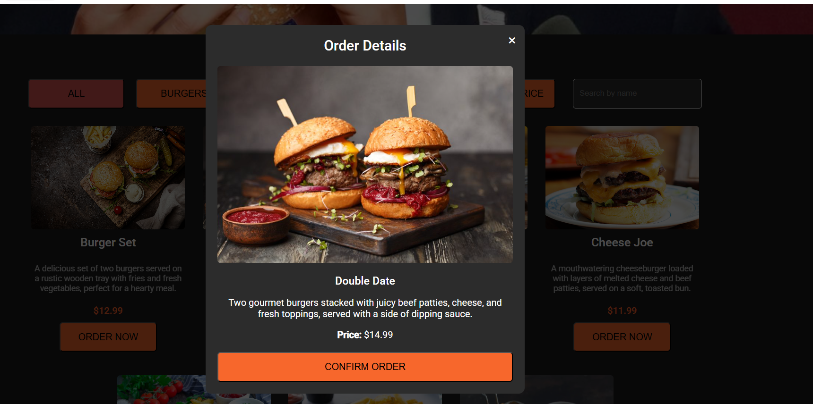
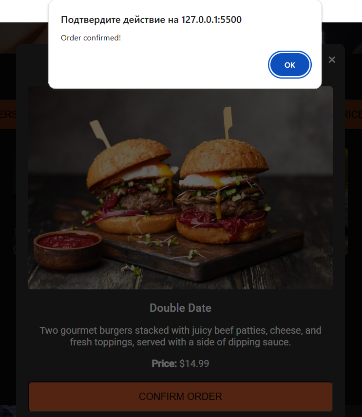
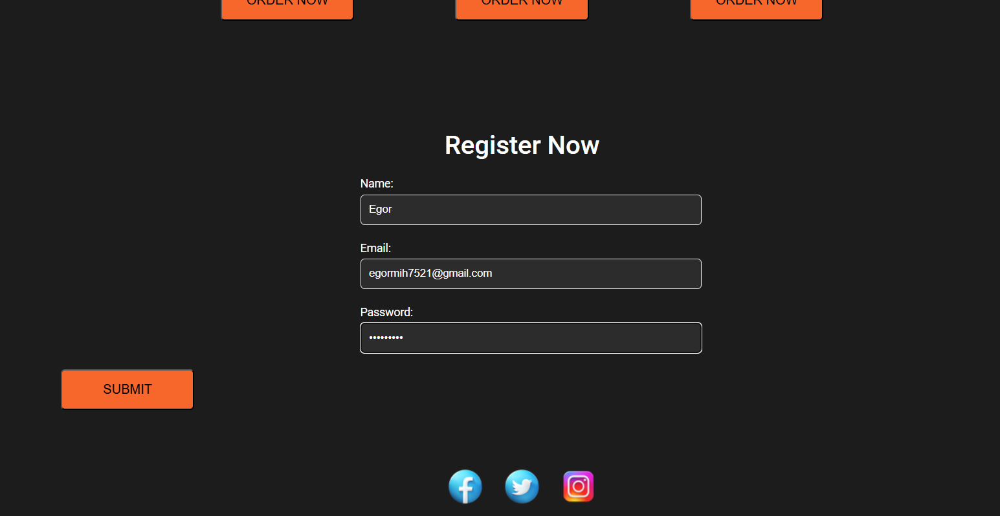
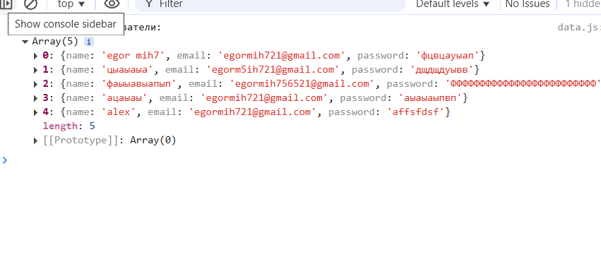

1. Цель проекта
Создать удобное веб-приложение для заказа еды, позволяющее пользователям просматривать меню, фильтровать блюда, сортировать их по цене, искать по названию и оформлять заказы.

2. Основные функции
Просмотр списка блюд с изображениями, названиями, описаниями и ценами.
Фильтрация блюд по категориям (например, бургеры, паэлья, тако).
Сортировка блюд по цене (по возрастанию или убыванию).
Поиск блюд по названию.
Оформление заказа через модальное окно.
Регистрация пользователей с валидацией формы и сохранением данных в localStorage.

### Авторы проекта: Mihailovschi Egor, Yakovlev Vladyslav
Список авторов

# Примеры использования
### При запуске приложения отображается список блюд с их изображениями, названиями, описаниями и ценами.

### Фильтрация по категориям
### Пользователь может нажать на кнопки категорий (например, "Burgers", "Paella", "Tacos") для фильтрации блюд.

# Сортировка по цене
### Нажмите на кнопку "Sort by Price", чтобы отсортировать блюда по цене.
document.querySelector(".sort-btn").addEventListener("click", () => {
    sortOrder = sortOrder === 'asc' ? 'desc' : 'asc';
    currentItems = [...currentItems].sort((a, b) => sortOrder === 'asc' ? a.price - b.price : b.price - a.price);
    displayMenu(currentItems);
});

# Оформление заказа
### Нажмите на кнопку "Order Now" на карточке блюда, чтобы открыть модальное окно и подтвердить заказ.

# Регистрация
### Заполните форму регистрации для сохранения данных пользователя.

# JSON
### Хранение записей

# Структура проекта
index.html — главная страница приложения.
styles.css — стили для интерфейса.
js/
data.js — данные меню и глобальные переменные, логика фильтрации, сортировки и поиска.
display.js — функция отображения меню.
modal.js — управление модальным окном.
form.js — валидация формы регистрации.
main.js — точка входа, инициализация.

Images/ — папка с изображениями блюд.

# Использованные источники
### Список ресурсов

1. Статья на Хабре: "Как правильно организовать ES-модули в JavaScript" — для понимания работы с модулями.
2. Статья на Хабре: "Работа с localStorage в JavaScript" — для реализации сохранения данных пользователей.
3. Документация MDN по JavaScript (Array methods, DOM manipulation).

# Дополнительная информация
Проект использует ES-модули, поэтому требует локального сервера.
Все данные хранятся локально в браузере (localStorage).
Для отладки используйте консоль браузера (F12).

