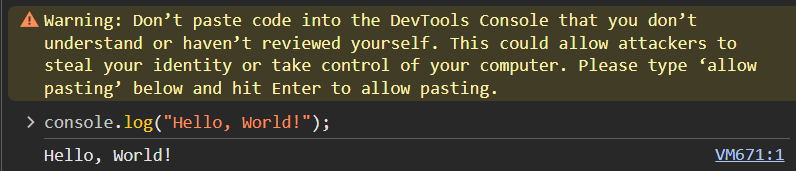
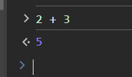
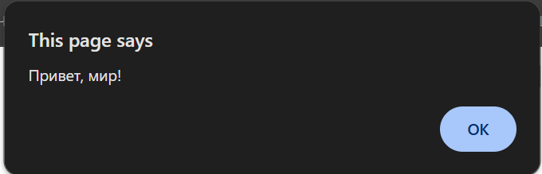
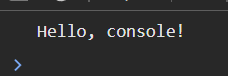
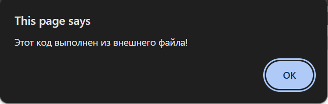
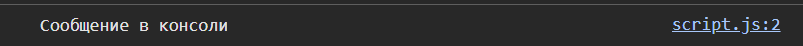
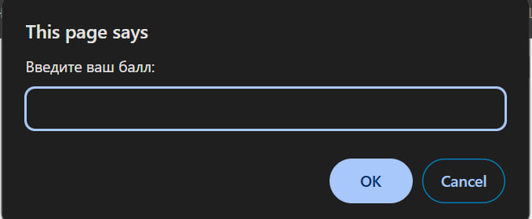
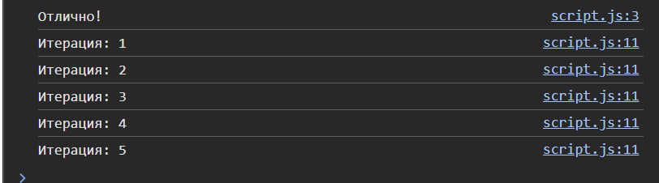

# Инструкции по запуску проекта:
Наличие IDE поддерживающего форматы .js, .html и .md

Импорт проекта / копирование блоков кода из README в соответствующие файлы

# Описание лабораторной работы
Краткое знакомство с базовым синтаксисом javascript

# Документация

### Подключение скрипта в html
При подключении скрипта в head он прогрузится до создания контента страницы body и будет иметь доступ только к объектам из head, прописанным выше него.
Если необходимо взаимодействовать с контентом из body, необходимо подключить скрипт в конце файла.


# Выполнение кода JavaScript в браузере

Для написания кода Javascript в браузере необходимо перейти в консоль разработчика, при помощи кнопки f12.

## Вывод Hello World при помощи консоли разработчика:

Попытка вставить код в консоль разработчика в Chrome приводит к ошибке, во избежание манипуляций со стороны злоумышленников

## Вывод суммы при помощи консоли разработчика:


## Создание первой HTML-страницы с JavaScript

В созданном в корневой папке файле index.html был вставлен следующий код:
```html
<!DOCTYPE html>
<html lang="en">
 <head>
   <title>Привет, мир!</title>
 </head>
 <body>
   <script>
     alert("Привет, мир!");
     console.log("Hello, console!");
   </script>
 </body>
</html>
```


Данный код выводит два сообщения:

Алерт:


И сообщение в консоль:


## Подключение внешнего JavaScript-файла

Перед подключением js кода необходимо создать файл с расширением .js


В нем был прописан код:
```javascript
alert("Этот код выполнен из внешнего файла!");
console.log("Сообщение в консоли");
```

Для подключения js файла необходимо добавить строку в head:
```javascript
<script src="scripts/script.js"></script>
```
Проверка в браузере:




# Работа с типами данных

## Объявление переменных и работа с типами данных.

Объявление переменных в script.js, инициализация и вывод в консоль:
```javascript
let name = "Your_Name";
let birthYear = 2006;
let IsStudent = true;
console.log(name, birthYear, IsStudent);
```
Где тип переменных определяется автоматически, и все переменные переданы как аргументы в один метод.


## Управление потоком выполнения (условия и циклы)

В script.js был добавлен следующий код:
```javascript
let score = prompt("Введите ваш балл:");
if (score >= 90) {
 console.log("Отлично!");
} else if (score >= 70) {
 console.log("Хорошо");
} else {
 console.log("Можно лучше!");
}

for (let i = 1; i <= 5; i++) {
 console.log(`Итерация: ${i}`);
}
```
При загрузке сайта нас встречает запрос:


После чего мы видим вывод в консоль:


Где от заданного параметра зависит выбранная ветка ответа.

# Контрольные вопросы

1. Чем отличается var от let и const?

var, в отличии от let, позволяет обратиться к себе из любой части программы и доступны вне своего блока (например объявлена в цикле для итерации, однако обратиться к ней
можно и после его завершения), так же позволяет объявлять переменные с одинаковыми именами, что приводит к проблемам с поддерживанием кода. Const же создает константные переменные (их значения невозможно изменить после инициализации)

2. Что такое неявное преобразование типов в JavaScript?
Неявное преобразование типов - автоматическое приведение одного типа данных к другому, зачастую в следствии присутствия переменных разных типов в одном выражении
(например float 5.3 + int 2 = float 7.3)


3. Как работает оператор == в сравнении с ===?
Оператор сравнения == сравнивает два значения, и при необходимости вызывает конвертацию одного типа данных в другой. 
Оператор === же выполняет ту же функцию, но не вызывает неявную конвертацию.

# Источники

[Основные типы объявления переменных](https://skillbox.ru/media/code/chem_razlichayutsya_var_let_i_const_v_javascript/)
[Преобразование типов в Javascript](https://habr.com/ru/companies/ruvds/articles/347866/)

