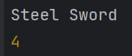
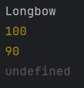

# Лабораторная работа №3

## Инструкция по запуку проекта:
Импортировать / копировать файл index.js в IDE, поддерживающую Node.js

## Описание лабораторной работы
Создание консольного приложения,
моделирующего систему инвентаря,
где можно добавлять предметы, изменять их свойства и управлять ими.

## Создание класса Item:
Класс Item будет содержать общие поля для всех объектов, принадлежащих предметам
```javascript
// Define valid rarity types for items
let validRarities = ["common", "uncommon", "rare", "legendary"]

/**
 * Class representing an item with a name, weight, and rarity.
 * Create a new Item.
 * @param {string} _name - The name of the item.
 * @param {number} _weight - The weight of the item.
 * @param {string} _rarity - The rarity level of the item (must be one of: "common", "uncommon", "rare", "legendary").
 * @throws Will throw an error if the rarity is invalid.
 */
class Item {
    constructor(_name, _weight, _rarity) {
        this.#name = _name;
        this.weight = _weight;
        if (!validRarities.includes(_rarity)) {
            throw new Error(`Invalid Rarity: ${_rarity}`);
        }
        this.rarity = _rarity;

    }
    // Private field for name
    #name;
    // Public properties
    weight;
    rarity;
    /**
     * Logs the item's name to the console.
     */
    getInfo() {
        console.log(this.#name);
    }
    /**
     * Sets a new weight for the item.
     * @param {number} newWeight - The new weight to assign to the item.
     */
    setWeight(newWeight) {
        this.weight = newWeight;
    }
}
```

## Создание класс Weapon
Класс Weapon будет наследником класса Item.
Помимо его полей, будет так же иметь поля Damage и Durability.
```javascript
/**
 * Class representing a weapon, extending the base Item class.
 * A Weapon has additional attributes: damage and durability.
 */
class Weapon extends Item {
    /**
     * Create a new Weapon.
     * @param {string} _name - The name of the weapon.
     * @param {number} _weight - The weight of the weapon.
     * @param {string} _rarity - The rarity of the weapon (must be valid).
     * @param {number} _damage - The amount of damage the weapon deals (must be >= 0).
     * @param {number} _durability - The durability of the weapon (must be >= 0).
     * @throws Will throw an error if damage or durability is negative.
     */
    constructor(_name, _weight, _rarity, _damage, _durability) {
        // Call parent constructor
        super(_name, _weight, _rarity);

        // Validate and assign damage
        if (_damage < 0) {
            throw new Error(`Invalid Damage: ${_damage}`);
        } else {
            this.damage = _damage;
        }

        // Validate and assign durability
        if (_durability < 0) {
            throw new Error(`Invalid Durability: ${_durability}`);
        } else {
            this.durability = _durability;
        }
    }

    // Public properties
    damage;
    durability;

    /**
     * Simulates using the weapon.
     * Reduces durability by 10 if durability is above 0.
     * Logs a message if the weapon is broken (durability <= 0).
     */
    use() {
        if (this.durability > 0) {
            this.durability -= 10;
        } else {
            console.log("Weapon is broken");
        }
    }

    /**
     * Repairs the weapon by resetting its durability to 100.
     */
    repair() {
        this.durability = 100;
    }
}
```
## Тесты приложения
### Проверка методов класса Item:
```javascript
const sword = new Item("Steel Sword", 3.5, "rare");
sword.getInfo()
sword.setWeight(4.0);
console.log(sword.weight);
```
Консоль:


### Проверка методов класса Weapon
```javascript
const bow = new Weapon("Longbow", 2.0, "uncommon", 15, 100);
bow.getInfo();
console.log(bow?.durability);
bow.use();
console.log(bow?.durability);
console.log(bow?.testField);
bow.repair();
```
Консоль:

Undefined мы получили вместо сообщения об ошибке,
при вызове несуществующего метода,
т.к. обращались к нему через опциональную цепочку.

## Вариант кода с использованием функций-конструкторов
```javascript
// Define valid rarity types for items
let validRarities = ["common", "uncommon", "rare", "legendary"];

/**
 * Constructor function for Item
 * @param {string} name - The name of the item.
 * @param {number} weight - The weight of the item.
 * @param {string} rarity - The rarity of the item.
 */
function Item(name, weight, rarity) {
    // Private variable (only accessible via closure, not enforced like class private fields)
    let _name = name;

    if (!validRarities.includes(rarity)) {
        throw new Error(`Invalid Rarity: ${rarity}`);
    }

    this.getName = function() {
        return _name;
    };

    this.getInfo = function() {
        console.log(_name);
    };

    this.weight = weight;
    this.rarity = rarity;
}

/**
 * Sets a new weight for the item.
 * @param {number} newWeight
 */
Item.prototype.setWeight = function(newWeight) {
    this.weight = newWeight;
};

/**
 * Constructor function for Weapon, which inherits from Item.
 * @param {string} name - The name of the weapon.
 * @param {number} weight - The weight of the weapon.
 * @param {string} rarity - The rarity of the weapon.
 * @param {number} damage - The weapon's damage value.
 * @param {number} durability - The weapon's durability.
 */
function Weapon(name, weight, rarity, damage, durability) {
    // Call Item constructor
    Item.call(this, name, weight, rarity);

    if (damage < 0) {
        throw new Error(`Invalid Damage: ${damage}`);
    }
    if (durability < 0) {
        throw new Error(`Invalid Durability: ${durability}`);
    }

    this.damage = damage;
    this.durability = durability;
}

// Inherit from Item
Weapon.prototype = Object.create(Item.prototype);
Weapon.prototype.constructor = Weapon;

/**
 * Use the weapon: decrease durability by 10 or log if it's broken.
 */
Weapon.prototype.use = function() {
    if (this.durability > 0) {
        this.durability -= 10;
    } else {
        console.log("Weapon is broken");
    }
};

/**
 * Repair the weapon: reset durability to 100.
 */
Weapon.prototype.repair = function() {
    this.durability = 100;
};
```

## Ответы на контрольные вопросы
1. Какое значение имеет this в методах класса?
В методах класса this ссылается на текущий экземпляр класса.
2. Как работает модификатор доступа # в JavaScript?
   Символ # делает свойство или метод приватным
— доступ к нему возможен только внутри класса,
в котором оно объявлено. Вне класса обращаться к такому свойству нельзя.
3. В чем разница между классами и функциями-конструкторами?
Классы - более удобная и современная форма.
Функции-конструкторы не поддерживают приватные поля,
и каждый метод нужно добавлять вручную при помощи prototype.