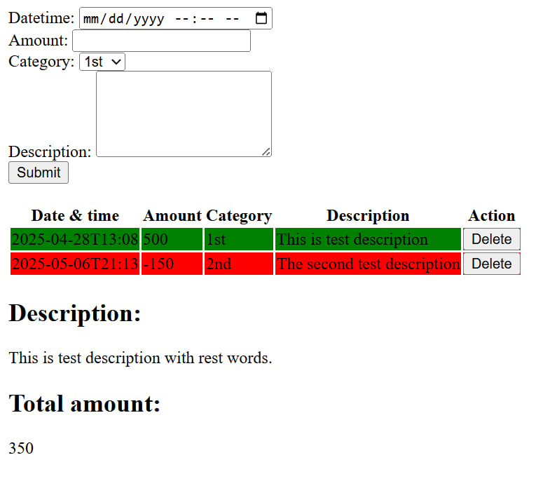

# Лабораторная работа №3

## Инструкция по запуку проекта:
Импортировать / копировать файлы проекта в IDE, поддерживающую Node.js

## Описание лабораторной работы
Создание web приложения для ведения таблицы транзакций.

## Архитектура проекта:

Проект состоит из нескольких модулей, и требует local/web сервер для работы:

- index.html - разметка страницы
- style.css - таблица стилей
- index.js - основной модуль, подключенный к html, в который импортируются остальные
- transactions.js - содержит массив транзакций и функции для работы с ним
- ui.js - модуль, отвечающий за взаимодействие с пользовательским интерфейсом
- utils.js - вспомогательные функции

## Демонстрация:

## Контрольные вопросы

1. Каким образом можно получить доступ к элементу на веб-странице с помощью JavaScript?
Мы можем получить доступ к элементу на веб-странице при помощи DOM, обратившись к методам объекта
document.

2. Что такое делегирование событий и как оно используется для
эффективного управления событиями на элементах DOM? 
Делегирование событий позволяет распостранить событие на всех наследников/родителей,
что позволяет привязать реагирование на событие на общего родителя, вместо привязки
к каждому элементу отдельно.

3. Как можно изменить содержимое элемента DOM с помощью JavaScript после его выборки?
   JavaScript после его выборки?
Изменить содержимое DOM-элемента после его выборки можно с помощью свойства .textContent, .innerHTML или .innerText.

4. Как можно добавить новый элемент в DOM дерево с помощью JavaScript?
Мы можем добавить элемент при помощи методов объекта document, например 
document.createElement()